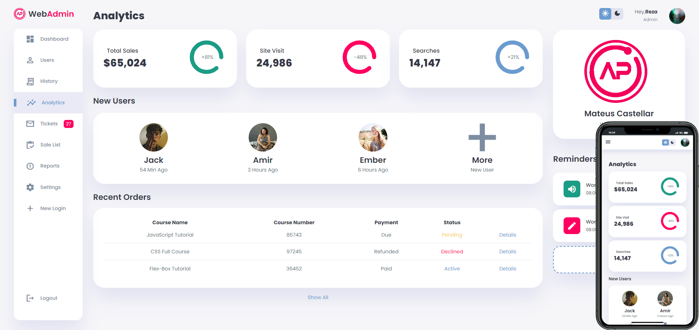
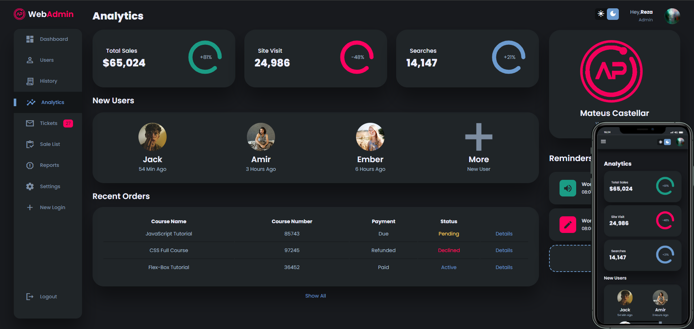

<h2 align="center">
  &nbsp;Admin Dashboard&nbsp;&nbsp;
</h2>

Dashboard web admin responsivo com suporte a temas dark/light.  

  <a href="#-tecnologias">Tecnologias</a>&nbsp;&nbsp;&nbsp;|&nbsp;&nbsp;&nbsp;
  <a href="#-projeto">Projeto</a>&nbsp;&nbsp;&nbsp;|&nbsp;&nbsp;&nbsp;
  <a href="#-layout">Layout</a>&nbsp;&nbsp;&nbsp;|&nbsp;&nbsp;&nbsp;
  <a href="#memo-licença">Licença</a>

  

 

  
   
  

## 🚀 Tecnologias

Esse projeto foi desenvolvido com as seguintes tecnologias:

- HTML e CSS
- JavaScript
- Git e Github

## 💻 Projeto

Uma página web desenvolvidas com ferramentas básicas da web com design clean e responsivo, com suporte a tema escuro.

- [Acesse o projeto finalizado, online]()

## :memo: Licença

Esse projeto está sob a licença MIT.
